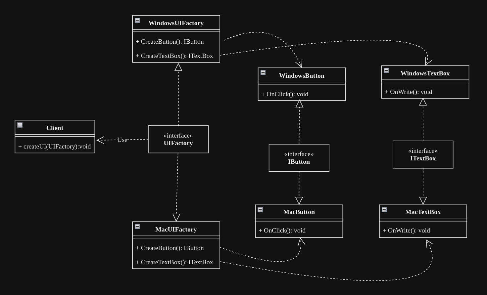

# Abstract Factory Design Pattern

## Abstract Factory
Abstract Factory is a creational design pattern that provides an interface for creating families of related or dependent objects without specifying their concrete classes. It serves as a factory of factories, allowing the creation of objects grouped by a common theme or purpose, such as various types of characters in a game. This pattern is particularly useful when there are multiple variations of a product, and the client code needs to remain agnostic about the specific implementation details. Instead, clients interact with the abstract factory interface, focusing uniquely on the creation of the desired objects without concerning themselves with the underlying classes or types.

