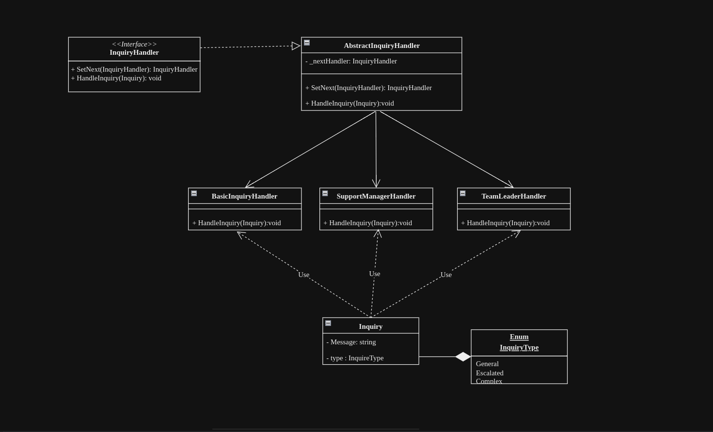

# Chain Of Responsability Design Pattern

The Chain of Responsibility pattern tackles complex processing scenarios by breaking them down into manageable steps handled by separate objects called handlers. Each handler focuses on a specific task or check and can decide whether to process the request itself or pass it to the next handler in a linked chain. This sequential processing allows for flexible and dynamic behavior, where each handler can contribute to the overall processing of the request. If a handler determines that it cannot handle the request, it can halt further processing, providing a graceful exit point in the chain. This pattern promotes modularity, reusability, and extensibility, making it suitable for scenarios like authentication checks, request validation, or any multi-step processing flow.

