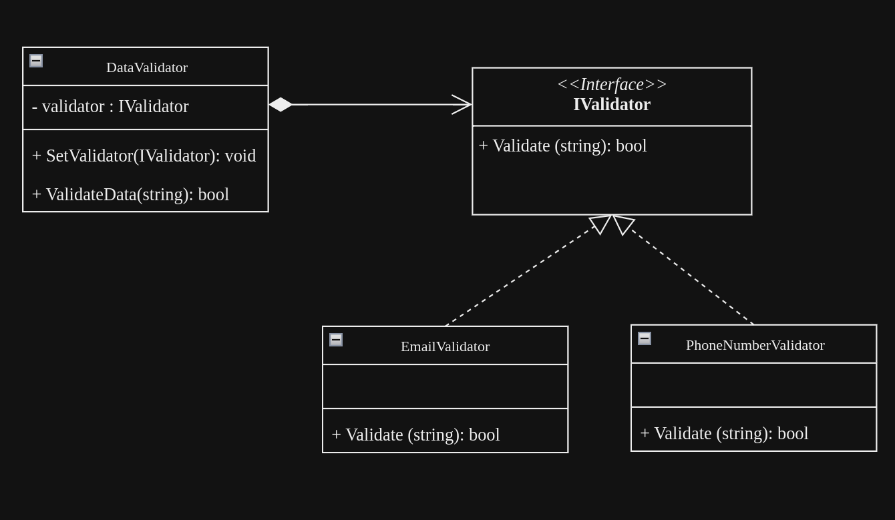

### STRATEGY DESIGN PATTERN

This design pattern consist of three components:

## Context :

A context represents where or how a strategy will be used (it does not define which strategy to use because the strategy is defined by the user). In the code, the context is `DataValidator`, which represents a place where data is validated.

## Strategy Interface :

The strategy interface defines a standard behavior for all classes that inherit from it. In this case, the interface representing this is IValidator.

## Strategies :

Strategies are those that define the specific behavior of a strategy since they are different from each other. In the code, they can be seen as `EmailValidator` and `PhoneNumberValidator`.

## UML

