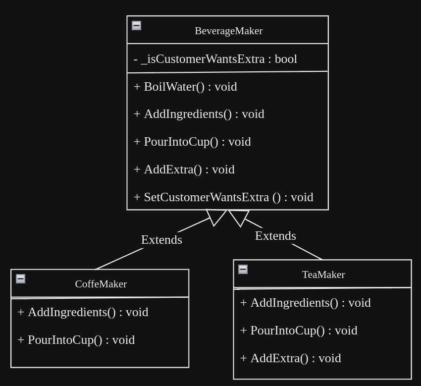

# TEMPLATE DESIGN PATTERN

## Components:

### Template Class (BeverageMaker)

- The template class defines the overall algorithm for preparing a beverage in the `MakeBeverage` method.
- It contains abstract methods `AddIngredients` and `PourIntoCup`, which represent steps of the algorithm that must be implemented by subclasses.
- The template class also includes optional hook methods (`AddExtra`) that subclasses can override to customize certain parts of the algorithm if needed.

### Concrete Classes (CoffeeMaker, TeaMaker)

- Concrete subclasses inherit from the template class and provide specific implementations for the abstract methods.
- Each concrete subclass implements the `AddIngredients` and `PourIntoCup` methods to prepare a specific type of beverage (coffee or tea).
- Subclasses can optionally override the `AddExtra` method to add extra ingredients based on specific requirements.

## UML
