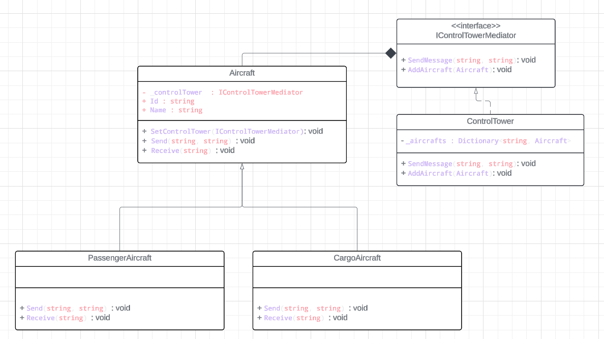

# Mediator Design Pattern Made Simple

The Mediator Design Pattern helps different parts of a program talk to each other without getting tangled up in direct connections. It uses a special object called a mediator to manage all the communication, so components don’t need to know about each other directly.

## Structure:

### Components:
- These are the parts of the program that do specific tasks (business logic).
- They get a reference to the mediator object when they're created (dependency injection).
- They only know about the mediator interface, not the specific implementation. This makes it easier to switch out mediators and test the components.

### Mediator Interface:
- This is a contract that defines how the mediator should work.
- Usually includes methods like `notify` that components use to send messages to the mediator.

### Concrete Mediators:
- These are specific implementations of the mediator interface.
- They know about the components and manage how they interact.
- Sometimes they also take care of creating and destroying components.

## Key Principles:

### Decoupling:
- Components don't know about each other. They only interact with the mediator.
- This reduces dependencies and makes the system easier to change and maintain.

### Black Box Interaction:
- For a component, the mediator is like a black box.
- A component sends a message to the mediator without knowing who will receive it.
- The receiving component doesn’t know who sent the message.

# UML

