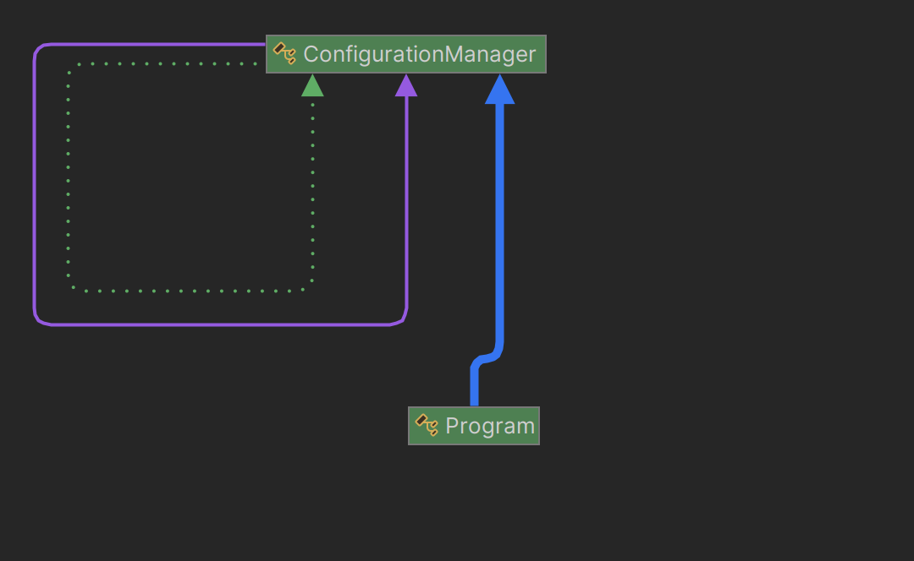

# SINGLETON DESIGN PATTERN

-----

**Name:** Jefersson Coronel Lavadenz

**Subject:** Software Development 5

**Trainer:** Carlos Pammo

-----

## SINGLETON DESIGN PATTERN
The Singleton design pattern is a creational design pattern that ensures that a class has only one instance and provides a global point of access to it. In other words, it restricts the instantiation of a class to a single object.

- **Purpose:** The purpose of the Singleton pattern is to ensure that a class has only one instance and to provide a global access point to that instance. This is accomplished by restricting access to the class constructor and providing a static method or property to access the single instance from anywhere in the program.
- **Use:** The singleton is used in situations where a single shared instance is needed throughout the program, such as managing database connections, event logs, or global configurations.
- **Structure:** The Singleton structure consists of a class with a private constructor and a static method or property to access the single instance.

**Why Singleton Design Pattern is an "anti-pattern"?**

**R.-** There are many reasons of some software design experts consider the Singleton pattern to be an anti-pattern and recommend avoiding it in favor of more flexible and maintainable alternatives, such as dependency injection or the use of dependency injection (DI) containers.
Some of these are:

- **Single Responsibility Principle Violation:** The Singleton combines the responsibility of creating a single instance with the logic of the class itself, violating the principle that a class should have only one responsibility.
- **Testability Issues:** Singleton classes are difficult to test in isolation because alternative instances cannot be created for testing purposes. This makes it harder to write unit tests and can lead to maintainability problems.
- **Concurrency Issues:** Although the Singleton pattern attempts to handle thread-safety, its implementation can be prone to errors and concurrency issues if not handled correctly.
- **Hidden Dependencies:** Using the Singleton pattern can introduce hidden dependencies in the code, making it difficult to track and understand dependencies within a system.
- **State Management Difficulties:** Since the Singleton is a global instance, it can be challenging to maintain and manage its state throughout the application's lifecycle, especially in large and complex applications.
- **Initialization Issues:** The order of initialization of Singletons can be problematic, especially if there are circular dependencies between them.
- **Violation of Dependency Inversion Principle:** The Singleton pattern can violate the Dependency Inversion Principle, as classes directly depend on a global instance rather than an abstraction.

**My project using singleton design pattern:**
In my project Singleton Design Pattern is applied to create and modified app's configurations.

1. **Singleton Class (ConfigurationManager):**
- I've created a ConfigurationManager class that acts as the Singleton.
- This class has a private constructor to prevent direct instantiation from outside the class and a private static instance of itself.
2. **Static Instance Retrieval Method (GetInstance):**
- I made a static method GetInstance() that acts as a global access point to retrieve the unique instance of ConfigurationManager.
- Within this method, I check if the instance already exists. If it doesn't, a new instance is created; otherwise, the existing instance is returned.
3. **Usage in the Main Program (Main):**
- In the Main method, I obtain the unique instance of ConfigurationManager using the static method GetInstance().
- Then, I use methods of this instance to set and get configuration values.
- Since the Singleton class ensures that only one instance exists throughout the program, I can use this same instance in different parts of the code, ensuring that they all share the same configuration.
