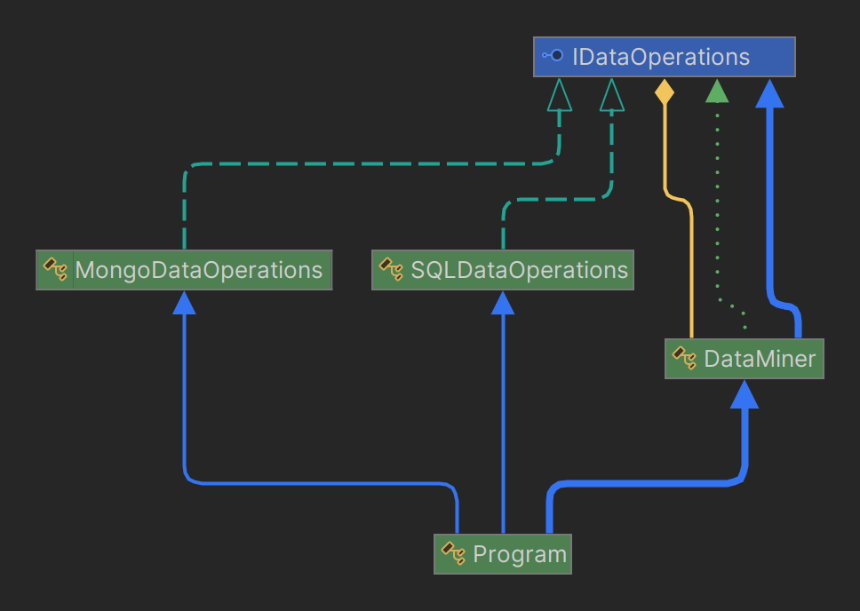
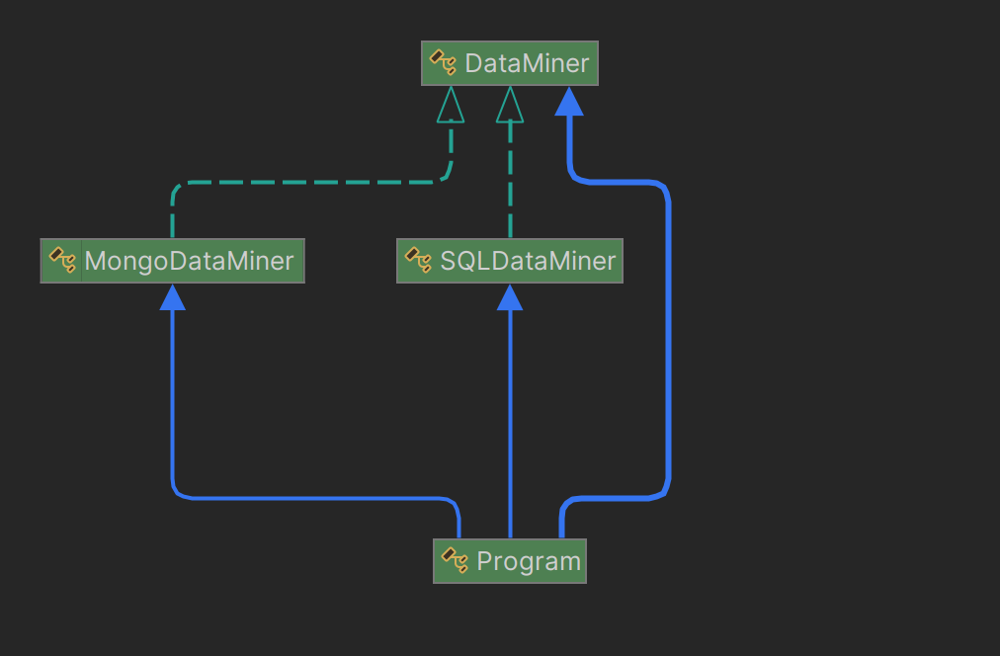

# TEMPLATE AND STRATEGY DESIGN PATTERNS

-----

**Name:** Jefersson Coronel Lavadenz

**Subject:** Software Development 5

**Trainer:** Carlos Pammo

-----

## Differences
- **Objective:** Strategy focuses on encapsulating different algorithms and making them interchangeable, while Template Method focuses on defining the skeleton of an algorithm and allowing subclasses to override specific parts.
- **Structure:** Strategy uses object composition, while Template Method uses inheritance.
- **Principles used:** Strategy uses the dependency injection principle, while Template Method uses the Liskov substitution principle and the open/closed principle.

## Similarities
- **Algorithm Encapsulation:** Both patterns encapsulate algorithms or parts of algorithms in separate classes or methods, promoting the single responsibility principle and facilitating maintenance and code reuse.
- **Flexibility in behavior:** Both Strategy and Template Method allow the behavior of an algorithm to be modified flexibly, either by changing the entire strategy (Strategy) or by overwriting specific parts of the algorithm (Template Method).
- **Code Reuse:** Both Strategy and Template Method facilitate code reuse by encapsulating algorithms or parts of algorithms into separate, reusable components.
- **Open/Closed Principle:** Both patterns follow the open/closed principle, which means that new behaviors (strategies or subclasses) can be added without modifying existing code.

## STRATEGY DESIGN PATTERN
The strategy design pattern is a behavior pattern that allows you to define a family of algorithms, encapsulate each of them, and make them interchangeable. This allows the algorithms to vary regardless of the clients using them. This pattern promotes code reuse, flexibility, and ease of maintenance. This pattern is commonly used in situations where different algorithms need to be implemented to solve a problem and these algorithms may vary in the future or be selected at runtime.

**Composition 'Has a' or Inheritance 'Is a'?**

**R.-** The Strategy design pattern uses composition instead of inheritance to achieve its purpose. In the Strategy pattern, the Context class maintains a reference to an object that implements the Strategy interface. This reference is established by dependency injection, either through the constructor or a setter method.

**My project using strategy design pattern:**

1. Interface IDataOperations:
   - Defines a set of operations that can be performed on different types of databases.
   - Each method represents a specific operation, such as connecting to the database, selecting a data source, processing data, etc.
2. Classes SQLDataOperations and MongoDataOperations:
   - Implement the IDataOperations interface and provide specific operations for working with SQL and MongoDB databases respectively.
   - Each class defines how to perform specific operations for its type of database.
3. Class DataMiner:
   - This class uses the IDataOperations interface as a private member.
   - In its constructor, a concrete instance of IDataOperations is passed, allowing it to dynamically switch between different implementations.
   - The MineData() method of DataMiner calls the methods of IDataOperations in the required order to perform data mining, but the specific implementation of each method is provided by the concrete instance passed to the constructor.
4. Class Program:
   - In the Main method, instances of DataMiner are created by passing different implementations of IDataOperations (in this case, SQLDataOperations and MongoDataOperations).
   - Then, the MineData() method is called on each DataMiner instance, executing the specific operations for the corresponding database.

## TEMPLATE DESIGN PATTERN
The Template Method design pattern is a design technique that defines the structure of an algorithm in a base class, but allows subclasses to modify certain steps of the algorithm without changing its overall structure. This is achieved by defining a "template" method in the base class that coordinates the steps of the algorithm and calls abstract methods or methods with default behavior that subclasses must implement. This pattern is used when there are a series of common steps in an algorithm that can vary in specific details. It allows common code to be reused and makes it easier to extend and maintain the code by providing a predefined structure.

**Composition 'Has a' or Inheritance 'Is a'?**

**R.-** This pattern uses inheritance to define the structure of the algorithm. The base class contains the template method that defines the sequence of steps of the algorithm, and the individual steps can be abstract methods or methods with default behavior that can be overridden by subclasses as necessary.

**My project using template design pattern:**

1. Abstract class 'DataMiner':
   - Defines the skeleton of the algorithm in the MineData() method. This method calls a series of abstract and virtual methods representing the steps of the algorithm.
   - Abstract methods (ConnectToDatabase(), SelectDataSource(), ProcessData()) must be implemented by subclasses and represent the specific steps each subclass must perform.
   - Virtual methods (ParseAndFormatData() and SendFormattedData()) have a default implementation in the base class but can be overridden by subclasses if needed.
2. Concrete classes SQLDataMiner and MongoDataMiner:
   - These are subclasses that extend the abstract class DataMiner and provide specific implementations for the abstract steps.
   - Each subclass implements the abstract methods to connect to a specific database (ConnectToDatabase() and SelectDataSource()), as well as to process data (ProcessData()).
   - The MongoDataMiner class overrides the virtual method ParseAndFormatData() to include a specific implementation for formatting MongoDB data.
3. Main() method:
   - In the Main() method, instances of the SQLDataMiner and MongoDataMiner classes are created.
   - Then, the MineData() method is called on each of these instances. This method executes the algorithm defined in the DataMiner class, but the implementation of each specific step is determined at runtime based on the concrete class being used.
