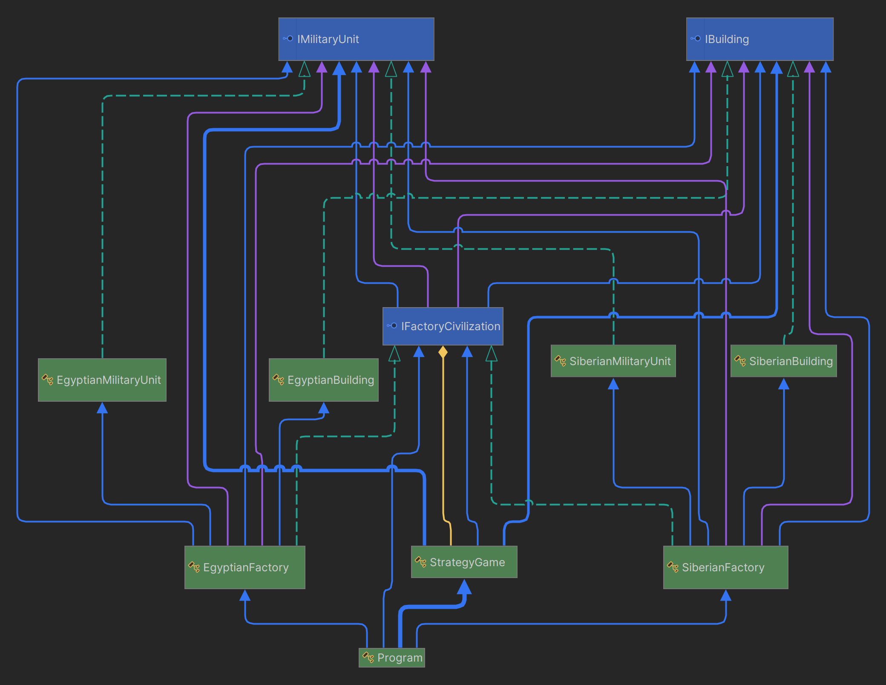
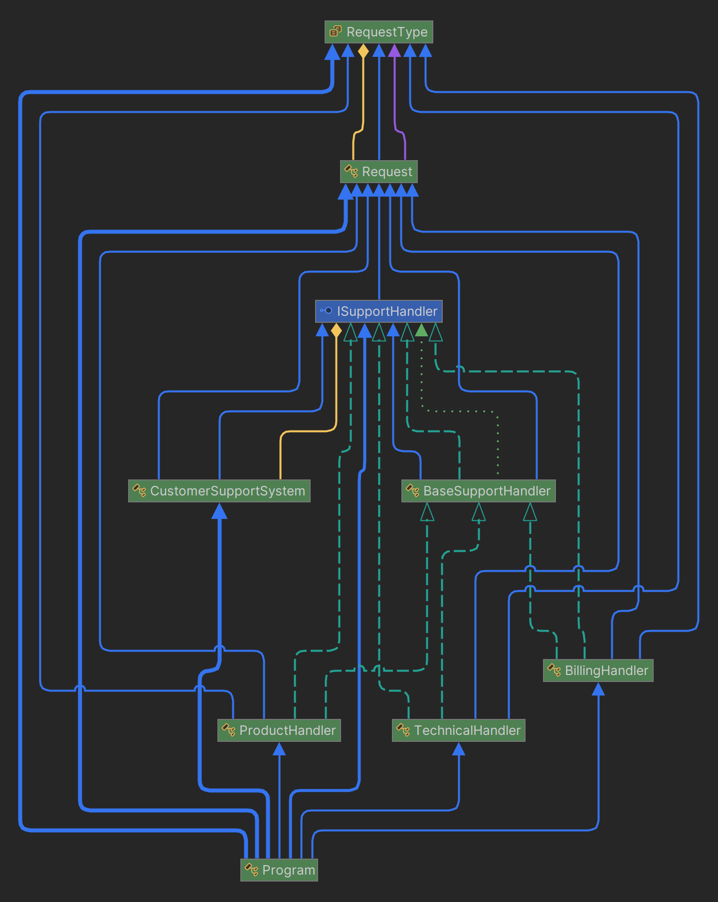

# ABSTRACT FACTORY & CHAIN RESPONSIBILITY DESIGN PATTERNS

-----

**Name:** Jefersson Coronel Lavadenz

**Subject:** Software Development 5

**Trainer:** Carlos Pammo

-----

## ABSTRACT FACTORY DESIGN PATTERN
The Abstract Factory design pattern is a creational design pattern that allows us to produce families of related objects without specifying their concrete classes.

- **Purpose:** This pattern is used to provide an interface for creating families of related or dependent objects without specifying their concrete classes. It allows the creation of objects without explicitly specifying the concrete classes, making it easy to switch between different implementations of a product family.
- **Use:** It is used when you need a way to create families of related objects without specifying their concrete classes. It is useful when a system needs to be independent of how its objects are created, composed, and represented.
- **Structure:** The structure of the Abstract Factory pattern involves defining an abstract factory interface or class that declares methods for creating objects of different related types. Concrete implementations of this interface provide the logic for creating concrete instances of these related objects.

**My project using abstract factory design pattern:**
In my project Abstract Factory Design Pattern is applied to create a strategy game (civilizations, buildings, military units) using factories.

1. **Interface Definitions:**
   - I've defined interfaces for `IBuilding`, `IMilitaryUnit`, and `IFactoryCivilization`.
   - These interfaces specify the operations that concrete related objects must perform.
2. **Abstract Classes:**
   - The classes `SiberianBuilding`, `EgyptianBuilding`, `SiberianMilitaryUnit`, and `EgyptianMilitaryUnit` are concrete implementations of `IBuilding` and `IMilitaryUnit`.
   - Each one represents a specific type of building or military unit with its own characteristics.
3. **Concrete Factories:**
   - `SiberianFactory` and `EgyptianFactory` are classes that implement `IFactoryCivilization`.
   - Each factory is responsible for creating concrete instances of buildings and military units for a specific civilization.
4. **Client Class:**
   - The `StrategyGame` class acts as the client that uses factories to create buildings and military units.
   - It takes an instance of `IFactoryCivilization` in its constructor and uses this factory to create the necessary objects.
5. **Usage in the Main Program:**
   - In the Main method, I create instances of the factories (`EgyptianFactory` and `SiberianFactory`) and then pass them to instances of StrategyGame. Then, I use the methods of StrategyGame to initialize building construction and create military units for each civilization.

## CHAIN RESPONSIBILITY DESIGN PATTERN
The Chain Responsibility Design Pattern is a behavioral design pattern that allows you to pass requests along a chain of handlers. Upon receiving a request, each handler decides whether to process it or pass it on to the next handler in the chain.

- **Purpose:** This pattern is used to create chains of receiver objects to process a request sequentially. Each receiver object decides whether it can handle the request or should pass it to the next object in the chain.
- **Use:** It is used when you want to decouple the sender of a request from its receivers, allowing more than one object to handle the request.
- **Structure:** The typical structure of the CoR pattern includes a series of handlers that are linked in a chain. Each handler has a link to the next handler in the chain. When a request is sent to the chain, each handler decides whether it can handle the request or pass it to the next handler in the chain.

**My project using chain responsibility design pattern:**
In my project Chain Responsibility Design Pattern is applied to chain multiple handlers and letting each handler decide whether to handle the request or pass it on to the next handler in the chain.

1. **Handler Interface and Base Class:**
   - I've defined the `ISupportHandler` interface and the `BaseSupportHandler` abstract class.
   - `ISupportHandler` declares methods for handling requests and setting the next handler in the chain, while `BaseSupportHandler` provides default implementation for setting the next handler and defines abstract methods for processing requests and checking if the handler can handle the request.
2. **Concrete Handlers:**
   - I've implemented concrete handler classes such as `BillingHandler`, `TechnicalHandler`, and `ProductHandler`, each responsible for handling specific types of requests.
   - Each handler overrides the `CanHandle` method to check if it can handle the incoming request based on its type, and implements the `ProcessRequest` method to perform the appropriate action.
3. **Customer Support System:**
   - I've created a `CustomerSupportSystem` class that takes the first handler in the chain as a parameter in its constructor.
   - This class provides a method `ProcessRequest` to initiate the request handling process by passing the request to the first handler in the chain.
4. **Main Program:**
   - In the Main method, I create instances of concrete handlers (`BillingHandler`, `TechnicalHandler`, `ProductHandler`) and chain them together by calling the `SetNextHandler` method to set the next handler in the sequence.
   - Then, I create an instance of `CustomerSupportSystem` with the first handler in the chain (billingHandler).
   - Finally, I call the `ProcessRequest` method of the support system for different types of requests, which will be handled by the appropriate handler in the chain.
