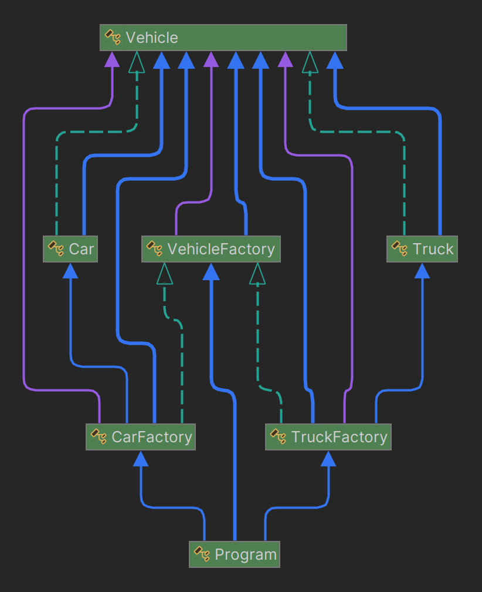
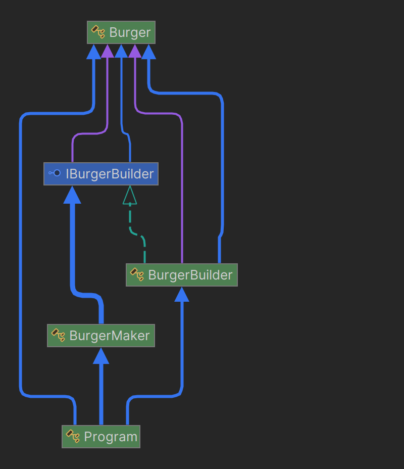

# BUILDER & FACTORY METHOD DESIGN PATTERNS

-----

**Name:** Jefersson Coronel Lavadenz

**Subject:** Software Development 5

**Trainer:** Carlos Pammo

-----

## FACTORY METHOD DESIGN PATTERN
The Factory Method design pattern is a creational pattern that provides an interface for creating objects in a superclass, but allows subclasses to alter the type of objects that are created. In other words, this pattern defines a method in a base class (often abstract) that subclasses can implement to create instances of objects suitable for their context.

- **Purpose:** The Builder pattern is used to construct complex objects step by step. It provides a way to build an object using a series of predefined or customizable steps.
- **Use:** It is useful when an object can have many different configurations, but we want to keep the construction process independent of the object's representation and how it is assembled.
- **Structure:** The Builder pattern typically consists of a Builder interface that defines the steps to build an object, one or more concrete implementations of this Builder that construct objects in different ways, and a Director that coordinates the construction process.

**My project using factory method design pattern:**
In my project Factory Method Design Pattern is applied to create vehicles (cars and trucks) using factories.

1. **Vehicle and Subclasses (Car, Truck):**
   - The Vehicle class is an abstract class representing a generic vehicle. It has properties for make, model, and year, and abstract methods Assemble() and Test().
   - Car and Truck are concrete subclasses of Vehicle, each implementing its own version of Assemble() and Test() methods.
2. **VehicleFactory and Subclasses (CarFactory, TruckFactory):**
   - VehicleFactory is an abstract class defining the factory method CreateVehicle() which returns a Vehicle object. It also provides a method ManufactureVehicle() which internally calls CreateVehicle(), Assemble(), and Test() methods.
   -  CarFactory and TruckFactory are concrete subclasses of VehicleFactory, each implementing the CreateVehicle() method to create instances of Car and Truck respectively.
3. **Program Usage or Client:**
   - In the Main() method, a CarFactory and a TruckFactory are instantiated.
   - The ManufactureVehicle() method of each factory is called with specific parameters (make, model, year) to manufacture vehicles.
   - The factory methods internally create instances of Car and Truck, which are then assembled and tested accordingly.

## BUILDER DESIGN PATTERN
The Builder Design Pattern is a creational design pattern that lets you construct complex objects step by step. The pattern allows you to produce different types and representations of an object using the same construction code

- **Purpose:** The Builder pattern is used to construct complex objects step by step. It provides a way to build an object using a series of predefined or customizable steps.
- **Use:** It is useful when an object can have many different configurations, but we want to keep the construction process independent of the object's representation and how it is assembled.
- **Structure:** The Builder pattern typically consists of a Builder interface that defines the steps to build an object, one or more concrete implementations of this Builder that construct objects in different ways, and a Director that coordinates the construction process.

**My project using builder design pattern:**
In my project Builder Design Pattern is applied to construct Burger objects with various configurations.

1. **IBurgerBuilder Interface:**
   - Defines the steps to build a burger by declaring methods like SetBreadType, SetPatty, AddCheese, AddVegetables, AddSauce, and GetBurger to retrieve the constructed burger.
2. **Burger Class:**
   - Represents the product being constructed by the builder. It has private properties for bread type, patty type, cheese presence, list of vegetables, and sauce. These properties are initialized through the constructor.
   - Overrides the ToString() method to provide a string representation of the burger's details.
3. **BurgerBuilder Class:**
   - Implements the IBurgerBuilder interface. It holds the state of the burger being constructed and provides methods to set its properties.
   - Implements GetBurger() method to return the constructed burger instance.
4. **BurgerMaker Class:**
   - Acts as a director in the Builder pattern. It defines methods like MakeClassicBurger and MakeVeggieBurger which take an IBurgerBuilder instance and call its methods to construct different types of burgers.
5. **Program Usage or Client:**
   - In the Main() method, a BurgerMaker instance is created.
   - A BurgerBuilder instance is created and passed to the MakeClassicBurger method of the BurgerMaker.
   - The MakeClassicBurger method configures the burger using the methods provided by BurgerBuilder.
   - After configuring, the GetBurger() method is called to retrieve the constructed classicBurger.
   - Similar steps are repeated for making a veggie burger.
   - Finally, the details of both burgers are printed to the console.
