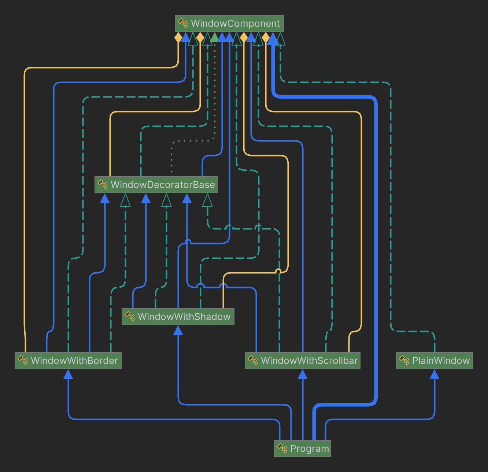

# DECORATOR DESIGN PATTERN

-----

**Name:** Jefersson Coronel Lavadenz

**Subject:** Software Development 5

**Trainer:** Carlos Pammo

-----

## DECORATOR DESIGN PATTERN
The Decorator design pattern is a structural pattern that allows additional functionality to be added to an object dynamically, without modifying its original implementation. In other words, it allows adding functionalities to objects by placing these objects inside special encapsulating objects that contain these functionalities.

- **Purpose:** The purpose of this pattern is to extend the capabilities of an object without modifying its original structure, thus allowing the composition of objects with new features in a transparent way.
- **Use:** It is useful when you want to add functionality to an object dynamically during program execution, avoiding the need to create multiple subclasses for each combination of features. This promotes a cleaner, more modular and flexible code, since it allows the addition and removal of features independently, without affecting other parts of the system.
- **Structure:** This pattern is composed of an abstract class that defines the common interface for all concrete components and their decorators. The concrete components are the base classes that represent the objects to which you want to add functionality. Decorators, on the other hand, are classes that implement the same interface as the concrete components and contain an instance of the original component, thus allowing the composition of additional functionalities. In this way, decorators can be stacked on top of each other to dynamically add multiple layers of functionality.

**My project using decorator design pattern:**
In my project Decorator Design Pattern is applied to create windows with extras functionalities or characteristics.

1. **Base Component (`WindowComponent`):**
   - This is your abstract base component that defines the common interface for all window components.
   - It defines an operation `DisplayWindow()` to display the description of the component and an abstract operation `GetCost()` to retrieve the cost of the component.
2. **Concrete Components (`PlainWindow`):**
   - These are the concrete classes that extend WindowComponent.
   - Each one provides a concrete implementation of `GetCost()` and defines its own description.
3. **Decorators (`WindowDecoratorBase`, `WindowWithScrollbar`, `WindowWithBorder`, `WindowWithShadow`):**
   - Decorators are classes that wrap base components and add additional functionality.
   - They extend `WindowDecoratorBase`, which in turn extends `WindowComponent`, and override methods as necessary.
   - Each decorator adds specific functionality (like scroll bars, borders, or shadows) to the base component.
4. **Usage in the Main Program (Main):**
   - In the Main method, I create instances of concrete components (like `PlainWindow`) and decorate them with other components (like `WindowWithScrollbar`, `WindowWithBorder`, `WindowWithShadow`).
   - Then, I call the `DisplayWindow()` and `GetCost()` methods on these objects to display their description and cost, respectively.
