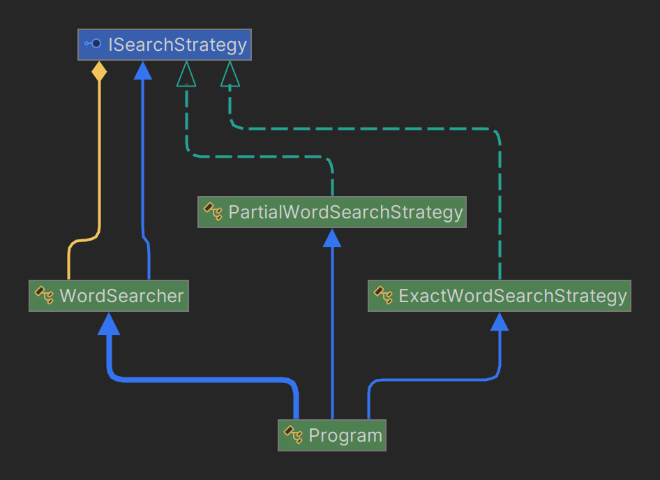
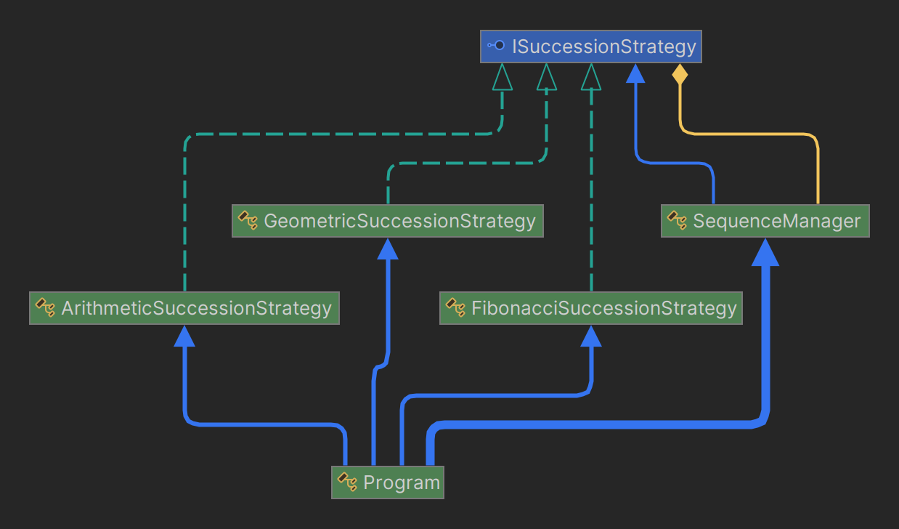

# SEARCH WORD FINDER & SUCCESSION MANAGER

-----

**Name:** Jefersson Coronel Lavadenz

**Subject:** Software Development 5

**Trainer:** Carlos Pammo

-----

## SEARCH WORD FINDER
### Problem:
Given a txt, md or string, a search for words in the file should be performed without the need to go through the text from beginning to end. Use a design pattern.

### Resolution:
To perform a search without having to traverse the entire text from beginning to end, use an index-based approach. That is, instead of searching directly in the contents of the file, you create an index that maps each word to its positions in the file. Then, when searching for a word, we simply query the index to get the corresponding positions. For this we will use dictionaries.  I also applied the strategy design pattern that will allow me to define more than one strategy to search for the word, in my case for the example I defined two: One for partial searches and one for complete searches.

        Example how use an index-based approach:
            _index = {
                ["hello"] = [0, 12],
                ["world"] = [6],
                ["again"] = [19]
        The key “hello” points to a list containing positions 0 and 12, which are the positions where the word “hello” appears in the text.
}
- One observation is I used a string because I have problems with the paths

## SUCCESSION MANAGER
### Problem:
You want to implement an inheritance manager. We have several examples of sequences such as the FIbonnaci or the Geometric. We know that in any sequence what changes is the calculation to the next value, so what design pattern could we apply to realize this manager?

### Resolution:
To realize this manager I definitely use the strategy design pattern because this pattern helps us to define a family of algorithms, encapsulating each of them and making them interchangeable. This allows me to dynamically change the algorithm used to calculate the next value of the sequence and not to modify the previous algorithms defined to calculate the next value if I want to add another one.

